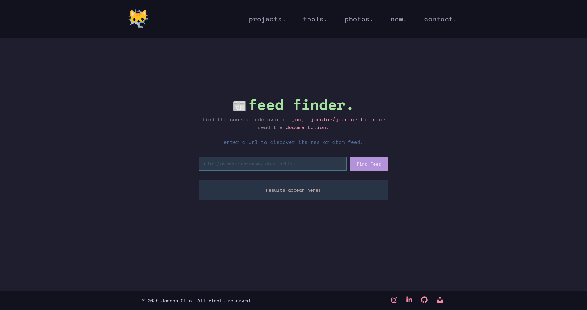

<h1 align="center">🌐👷‍♂️ joestar-tools</h1>

<p align="center">
    
</p>

some client-side tools, by me :3
(an extension of my [portfolio website](https://joestar.is-a.dev/) ([repo](https://github.com/joejo-joestar/joestar)))

to run this project locally, you need to have [Node.js](https://nodejs.org/) installed. And then run the following commands:

```bash
npm i
npm run dev
```

## 🙏 Special Thanks

- [catppuccin](https://catppuccin.com/) for the color scheme
- [Emoji Kitchen](https://fonts.google.com/noto/specimen/Noto+Color+Emoji) for the remixed emojis

---

## 👷‍♂️ Tools

a list of available tools

### Feed Finder

a simple clientside rss / atom news feed detector

<details>
    <summary>Preview</summary>
    <p align="center">
        
    </p>
</details>

### Schema Maker

a clientside visual [json schema](https://json-schema.org/understanding-json-schema/about) generator

<details>
    <summary>Preview</summary>
    <p align="center">
        
    </p>
</details>

---

## 🗂️ Project Structure

Below is a compact tree of the most important files and folders with a short note about their purpose.

```plaintext
joestar-tools
├── eslint.config.js    # ESLint rules and configuration
├── index.html          # App HTML entry point
├── LICENSE             # License file
├── package.json        # npm scripts, dependencies
├── README.md           # Project documentation
├── tsconfig.app.json   # TypeScript app config
├── tsconfig.json       # TypeScript configuration
├── tsconfig.node.json  # TypeScript node config
├── vercel.json         # Vercel deployment configuration
├── vite.config.ts      # Vite build/dev server config
├── public/          # Static assets served as-is
│   └── pixlogo.png  # Logo image
└── src/                # Source code
    ├── catppuccin.css  # Theme / color tokens
    ├── index.css       # Global styles
    ├── main.tsx        # React app bootstrap
    ├── vite-env.d.ts   # Vite/TypeScript types
    ├── assets/  # Images used by the UI
    │   ├── Icons.tsx
    │   ├── pixcodingcar.png
    │   └── pixnewscar.png
    ├── components/            # Reusable UI components
    │   ├── FeedFinderComps/   # Components for the Feed Finder App
    │   ├── Footer/            # Footer component
    │   ├── Navbar/            # Navigation bar component
    │   └── SchemaMakerComps/  # Components for the Schema Maker App
    ├── hooks/  # Custom React hooks
    │   ├── searchService.ts
    │   ├── useMediaQuery.tsx
    │   └── useScrollToTop.tsx
    ├── routes/           # Page routes (React Router)
    │   ├── FeedFinder/   # Feed Finder App
    │   ├── Home/         # Home page
    │   ├── Missingno/    # 404 page
    │   └── SchemaMaker/  # Schema Maker App
    ├── shared/             # Shared utilities / data
    │   ├── constants.ts    # Constants used by the tools
    │   ├── socialsList.ts  # Social links used across the site
    │   └── types.ts        # Custom types
    └── utils/                  # utilities
        ├── schemaConverter.ts  # Utitlty to convert schema to UI blocks
        └── snippets.ts         # Custom Snippets for the schema editor
```

---

## 📋 Todo

Go to the linked [GitHiub Projects](https://github.com/users/joejo-joestar/projects/1/views/1) for a more flushed out "todo" list!
