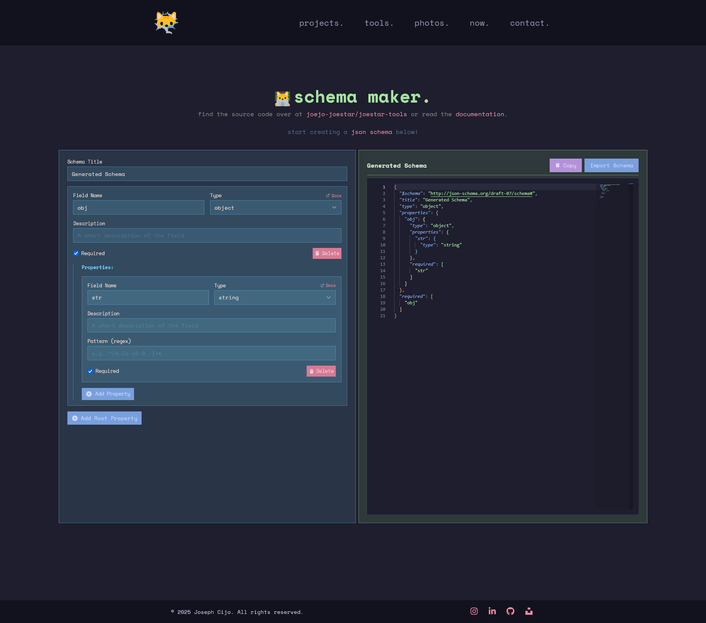

<h1 align="center">
    
schema maker.
</h1>

a clientside visual [json schema](https://json-schema.org/understanding-json-schema/about) generator

    

## 📚 Docs

>[!NOTE]
> The generator only creates schemas following the [`draft-07`](https://json-schema.org/draft-07) metaschema (it is hardcoded in the for now)

## ✨ Features

- Build JSON Schemas using Visual Blocks!
- [Monaco Editor](https://microsoft.github.io/monaco-editor/) for dispalying the genrated schema
  - and manually editing it!
  - yes, you get "most" of the features of the VS Code Editor as well >:3
- [Shiki Monaco Editor Integration](https://shiki.style/packages/monaco) for the syntax highlighting (in the [catppuccin color scheme](https://github.com/catppuccin/vscode/tree/main/packages/catppuccin-vscode))
-